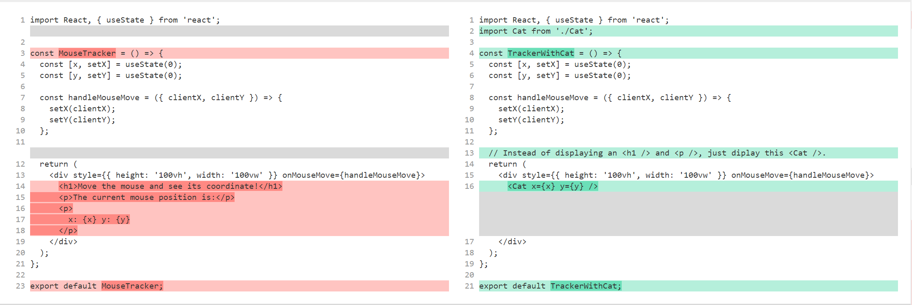
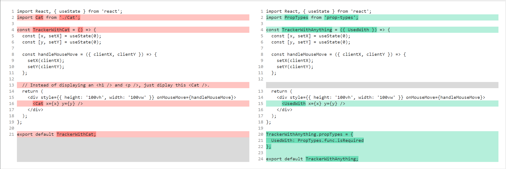
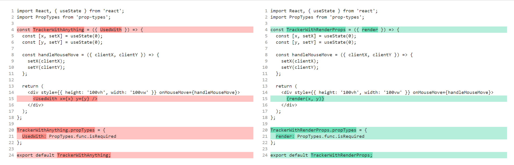

# Render Props, Part I

In this series of 2 posts, I am going to talk about **render props** in React. This series is based on [React Blog's tutorial on Render Props](https://reactjs.org/docs/render-props.html); I had a hard time understanding that one, so after I grapsed the concept I created my own guide to break everything down.

You might be thinking, "there is already an official one, so why should I bother reading this one then?" Let me start by saying, I won't claim my guide is better. However, my guide is different, because it shows:

1. The difficulties people run into when not using **render props**
1. How people discovered this pattern, and you can write it
1. Popular libraries using this pattern, and how you can use those libraries
1. Common ways of misusing **render props**, and what the alternatives are

If you just want a quick rundown on **render props**, and you're good at reading and understanding concise programming guides, the official one may be the better option for you. However, if you're like me who prefer dijesting concept in smaller bites and having trouble understand the official one, give this series a try; maybe it can make the concept clearer.

In this 1st post of the series, I will talk about the first 2 points: why we need it, and how to write components using it.

## Table of Contents

<!-- TOC -->

- [Table of Contents](#table-of-contents)
- [Definition](#definition)
- [Motivation](#motivation)
- [Step 0: Not Doing Anything](#step-0-not-doing-anything)
- [Step 1: Cat & Mouse (Hard Coded)](#step-1-cat--mouse-hard-coded)
- [Step 2: Cat & Mouse (As a Prop)](#step-2-cat--mouse-as-a-prop)
- [Step 3: Drawback](#step-3-drawback)
- [Step 4: Render Props](#step-4-render-props)
- [Summary](#summary)

<!-- /TOC -->

## Definition

Render props is a way of **reusing a React component by exposing its `render` function as a prop**, like this:

```javascript
<Mouse render={(mouse) => <Cat mouse={mouse} />} />
```

If that definition and example don't make sense yet, don't worry. The purpose of this series is to help you understand that.

## Motivation

Let's start with a component: in the next file, `<MouseTracker />` trackers a user's mouse position on the screen, and print in on screen:

```javascript
// MouseTracker.jsx
import React, { useState } from 'react';

const MouseTracker = () => {
  const [x, setX] = useState(0);
  const [y, setY] = useState(0);

  const handleMouseMove = ({ clientX, clientY }) => {
    setX(clientX);
    setY(clientY);
  };

  return (
    <div style={{ height: '100vh', width: '100vw' }} onMouseMove={handleMouseMove}>
      <h1>Move the mouse and see its coordinate!</h1>
      <p>The current mouse position is:</p>
      <p>
        x: {x} y: {y}
      </p>
    </div>
  );
};

export default MouseTracker;
```


If we inspect our component, we'll see it does 2 things:

- Track the mouse cursor location to get the value of `x` and `y`. That is our **business logic**; it's related to _how the application works underneath_, not _how the UI is presented to the user_.
- Display `x` and `y`, and some text on the screen in the `render` function. That is the **view logic**; it dictates how the UI would look like to an end user.

Let's take our `<MouseTracker />` component 1 step further. What if I want to make my `<MouseTracker />` component reusable by:

1. Reusing its business logic, so it can still detect mouse cursor location
1. Letting people customize its view logic, so it can render whatever is specified, instead of only displaying "Move the mouse and see its coordinate!"

How can write this new component so it can take customized view logic?

## Step 0: Not Doing Anything

Right now, anywhere we use `<MouseTracker />` would only satisfy #1, not #2. They'll all track the mouse cursor location (_which is good_), but they all display "Move the mouse and see its coordinate!" (_which is bad_).

We didn't do anything yet, but at least we know currently our `<MouseTracker />` component does not satisfy requirement #2.

## Step 1: Cat & Mouse (Hard Coded)

We don't know how to make it take customized view logic yet, so let's start with a naive approach first: hard code the new view logic. After we hard code something different, it'll be more obvious where to go next.

Imagine this new scenario: instead of displaying some text inside the `render` function, we want to display a new React component called `<Cat />`; it accepts the x coordinate and the y coordinate, and displays a cat icon at that coordinate. The purpose is to make this cat follow the user's cursor. The end product looks like this:


So `<Cat />` might looks like this:

```javascript
// Cat.jsx
import React from 'react';
import PropTypes from 'prop-types';
import cat from './cat.png';

const Cat = ({ x, y }) => ;

Cat.propTypes = {
  x: PropTypes.number.isRequired,
  y: PropTypes.number.isRequired
};

export default Cat;
```

Create a `<TrackerWithCat />` component that's basically the same as `<MouseTracker />`; only the `render` function is different:

```javascript
// TrackerWithCat.jsx
import React, { useState } from 'react';
import Cat from './Cat';

const TrackerWithCat = () => {
  const [x, setX] = useState(0);
  const [y, setY] = useState(0);

  const handleMouseMove = ({ clientX, clientY }) => {
    setX(clientX);
    setY(clientY);
  };

  // Instead of displaying an <h1 /> and <p />, just diplay this <Cat />.
  return (
    <div style={{ height: '100vh', width: '100vw' }} onMouseMove={handleMouseMove}>
      <Cat x={x} y={y} />
    </div>
  );
};

export default TrackerWithCat;
```

[Diff from `<MouseTracker />` to `<TrackerWithCat />`](https://www.diffchecker.com/EJ6d01WM):



And this would be how we use them together:

```javascript
// App.jsx
import React, { Component } from 'react';
import TrackerWithCat from './TrackerWithCat';
import './App.css';

class App extends Component {
  render() {
    return (
      <div className="App">
        <header className="App-header">
          <TrackerWithCat />
        </header>
      </div>
    );
  }
}

export default App;
```

Our new component, `<TrackerWithCat />` is almost the same as `<MouseTracker />`; the only difference is what they hard code inside their respective `render` function. So now it's pretty obvious: if we want to customize their view logic, we can expose its view logic as a prop, so the tracker component's parent can pass in the view logic.

## Step 2: Cat & Mouse (As a Prop)

So, let's expose the render logic as a prop instead of hard code `<Cat />` inside the `render` function:

```javascript
// TrackerWithAnything.jsx
import React, { useState } from 'react';
import PropTypes from 'prop-types';

const TrackerWithAnything = ({ UsedWith }) => {
  const [x, setX] = useState(0);
  const [y, setY] = useState(0);

  const handleMouseMove = ({ clientX, clientY }) => {
    setX(clientX);
    setY(clientY);
  };

  return (
    <div style={{ height: '100vh', width: '100vw' }} onMouseMove={handleMouseMove}>
      <UsedWith x={x} y={y} />
    </div>
  );
};

TrackerWithAnything.propTypes = {
  UsedWith: PropTypes.func.isRequired
};

export default TrackerWithAnything;
```

[Diff from `<TrackerWithCat />` to `<TrackerWithAnything />`](https://www.diffchecker.com/SoZN1YIp):



```javascript
// App.jsx
import React, { Component } from 'react';
import MouseWithAnything from './MouseWithAnything';
import Cat from './Cat';
import './App.css';

class App extends Component {
  render() {
    return (
      <div className="App">
        <header className="App-header">
          <MouseWithAnything UsedWith={Cat} />
        </header>
      </div>
    );
  }
}

export default App;
```

`<Cat />` remains the same.

Since we are talking about customize the view logic, let's swap `<Cat />` out with something else. For example:

```javascript
import React, { Component } from 'react';
import PropTypes from 'prop-types';
import TrackerWithAnything from './TrackerWithAnything';
// import Cat from './Cat';
import './App.css';

const CoordDisplay = ({ x, y }) => (
  <div>
    <h1>You have put the cursor at:</h1>
    <p>
      x: {x}, y: {y}
    </p>
  </div>
);

CoordDisplay.propTypes = {
  x: PropTypes.number.isRequired,
  y: PropTypes.number.isRequired
};

class App extends Component {
  render() {
    return (
      <div className="App">
        <header className="App-header">
          <TrackerWithAnything UsedWith={CoordDisplay} />
        </header>
      </div>
    );
  }
}

export default App;
```

## Step 3: Drawback

Ok, our approach seems to work well! There is a drawback though: by specifying

```javascript
<UsedWith x={x} y={y} />
```

inside `<TrackerWithAnything />` component, we're restricting the shape of customized view logic: `<UsedWith />` is designed to take in another React component that also accepts exactly an `x` prop and a `y` prop. Take a look at our `<Cat />` component and `<CoordDisplay />` component; they have to be written that way to be used with `<TrackerWithAnything />`. What if our component wants a 3rd prop? It's hard to pass that in. Here is an example: we have a new component, `<ComplicatedCat />`, that requires a 3rd prop:

```javascript
// ComplicatedCat.jsx
import React from 'react';
import PropTypes from 'prop-types';

const ComplicatedCat = ({ x, y, food }) => (
  <div>
    <h1>
      Coordiates: x: {x}, y: {y}
    </h1>

    <h2>Human, feed me {food}!</h2>
  </div>
);

ComplicatedCat.propTypes = {
  x: PropTypes.number.isRequired,
  y: PropTypes.number.isRequired,
  food: PropTypes.string.isRequired
};

export default ComplicatedCat;
```

Now if we look at `App.jsx` we'll see we're in trouble:

```javascript
// App.jsx
import React, { Component } from 'react';
import TrackerWithAnything from './TrackerWithAnything';
// import Cat from './Cat';
import ComplicatedCat from './ComplicatedCat';
import './App.css';

class App extends Component {
  render() {
    return (
      <div className="App">
        <header className="App-header">
          <TrackerWithAnything UsedWith={ComplicatedCat} />
        </header>
      </div>
    );
  }
}

export default App;
```

There is no way to pass the 3rd prop, `food` in! That is not good. Sure we allowed customized view logic, but that customization is still restricted to React components in a certain shape. How can we loosen that requirement?

## Step 4: Render Props

Instead of specifying a `<UsedWith />` component, let's just specify a function, and pass in the `x` and `y` coordinates:

```javascript
// TrackerWithRenderProps.jsx
import React, { useState } from 'react';
import PropTypes from 'prop-types';

const TrackerWithRenderProps = ({ render }) => {
  const [x, setX] = useState(0);
  const [y, setY] = useState(0);

  const handleMouseMove = ({ clientX, clientY }) => {
    setX(clientX);
    setY(clientY);
  };

  return (
    <div style={{ height: '100vh', width: '100vw' }} onMouseMove={handleMouseMove}>
      {render(x, y)}
    </div>
  );
};

TrackerWithRenderProps.propTypes = {
  render: PropTypes.func.isRequired
};

export default TrackerWithRenderProps;
```

[Diff from `<TrackerWithAnything />` to `<TrackerWithRenderProps />`](https://www.diffchecker.com/JBweQ8Fd):



Now let's see how this makes things better: in `App.jsx`, we can do things a bit differently:

```javascript
// App.jsx
import React, { Component } from 'react';
import TrackerWithRenderProp from './TrackerWithRenderProp';
import ComplicatedCat from './ComplicatedCat';
import './App.css';

class App extends Component {
  render() {
    return (
      <div className="App">
        <header className="App-header">
          <TrackerWithRenderProp render={(x, y) => <ComplicatedCat x={x} y={y} food="Salmon" />} />
        </header>
      </div>
    );
  }
}

export default App;
```

See? Now with `render` prop as a generic function with 2 parameters, we can specify the 3rd props for `<ComplicatedCat />` in whatever way we want. That `food` prop? We can retrieve the value from some other components. Maybe from the Redux store. Maybe just hard coded like we did. Point being, `<TrackerWithRenderProp />` does not require `<ComplicatedCat />` to be a React component that comforms to a strict shape. I could do this as well:

```javascript
import React, { Component } from 'react';
import TrackerWithRenderProp from './TrackerWithRenderProp';
import './App.css';

class App extends Component {
  render() {
    return (
      <div className="App">
        <header className="App-header">
          <TrackerWithRenderProp
            render={(x, y) => (
              <p>
                Huh? {x}, {y}
              </p>
            )}
          />
        </header>
      </div>
    );
  }
}

export default App;
```

That was impossible in our previous approach; we'll have to create a new component to wrap the `<p>` inside.

## Summary

Now, let's look back at the definition of **render props** once again:

Render props is a way of **reusing a React component by exposing its `render` function as a prop**, like this:

```javascript
<Mouse render={(mouse) => <Cat mouse={mouse} />} />
```

And when we say "reuse a React component", we meant:

1. We want to reuse its business logic;
1. We would like to customize its view logic.

If we look at that `<Mouse />` component, it's obvious that with the `render` function exposed, we can customize its rendering logic.

You've learnt these things about **render props** for now:

1. What problems they are designed to solve
1. How to write your own component with **render props**

If you're in a rush to use it, you may stop reading now. However, if you want to understand some additional useful information about it, I recommend you read my 2nd post of the same series to know:

1. Popular libraries using this pattern, and how you can use those libraries. We'll talk about [React Router](https://reacttraining.com/react-router/).
1. Drawbacks of **render props** and what are the alternatives.
