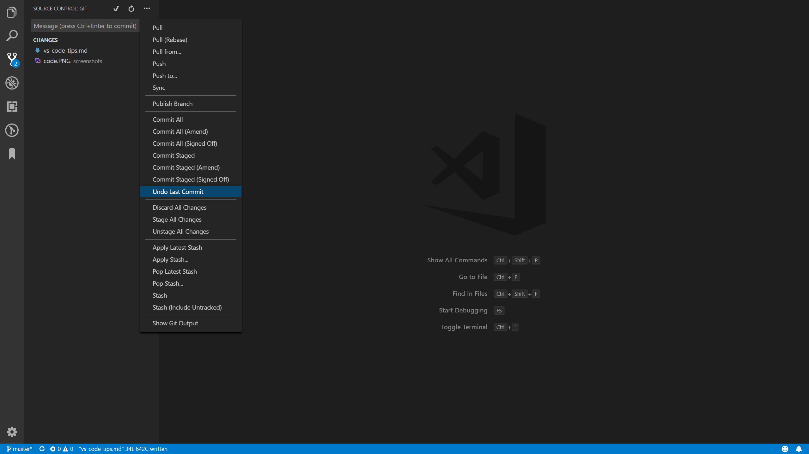

<!-- TOC depthFrom:2 -->

- [Increase Productivity](#increase-productivity)
- [Plugins](#plugins)

<!-- /TOC -->

# VS Code Tips

This doc is a note from this YouTube video:

[VS Code Top-Ten Pro Tips](https://www.youtube.com/watch?v=u21W_tfPVrY) by [Fireship](https://www.youtube.com/channel/UCsBjURrPoezykLs9EqgamOA).

## Increase Productivity

1. Once navigated to the desired location on the terminal, use `code` to open VS Code.

   

1. Zen mode

   

1. Open the terminal by:
   - Pressing `CTRL` + `~`
   - Clicking on the bottom left corner with warnings and errors.
   - Dragging from the top of the bottom blue bar.
1. Revert git commit in the GUI

   

## Plugins

1. Bookmark
1. ES7 React/Redux/GraphQL/React-Native snippets
1. Paste JSON as code
1. Debugger for Chrome
